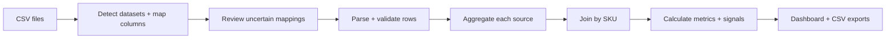

# Product Pounce

Product Pounce turns fragmented e-commerce CSV exports into a prioritized, explainable list of products that need attention—all locally in the browser.

**[Try the live demo](https://product-pounce.vercel.app/)**


## Why I Built It

E-commerce analysts and store operators often receive product, sales, and inventory exports with inconsistent schemas. Before they can investigate a stockout, revenue decline, margin concern, or data-quality problem, they have to clean and cross-reference spreadsheets.

Product Pounce handles that preparation and turns the result into an evidence-first review workflow. It detects each dataset, proposes column mappings, validates and joins records, calculates performance metrics, and surfaces the products worth investigating. Every result remains traceable to its calculation and original source rows.

## What This Project Demonstrates

- **Product thinking:** turns a broad analytics problem into a focused workflow that moves from raw files to prioritized actions.
- **End-to-end ownership:** covers ingestion, interaction design, data processing, visualization, exports, accessibility, testing, and deployment.
- **Reliable data handling:** validates inputs, represents uncertainty explicitly, withholds unsupported comparisons, and preserves rejected data for review.
- **Production-minded engineering:** uses typed boundaries, pure testable pipeline stages, privacy-conscious architecture, and browser-level regression tests.
- **Deliberate AI boundaries:** keeps high-stakes calculations deterministic while identifying where future model-assisted schema mapping could add value safely.

## Key Features

- **Flexible CSV ingestion:** recognizes common header aliases, partial matches, and small spelling differences across product, sales, and inventory exports.
- **Human review for uncertainty:** highlights low-confidence required-field mappings instead of silently guessing.
- **Prioritized product signals:** surfaces stockouts, sales declines, low inventory, slow-moving stock, margin concerns, price inconsistencies, reputation signals, and structural data issues.
- **Explainable results:** shows the condition, supporting values, business relevance, suggested investigation, and limitation behind each signal.
- **Like-for-like comparisons:** calculates revenue, orders, units, average order value, and trends over equal periods anchored to the uploaded data.
- **Visible data quality:** summarizes rejected rows, invalid values, duplicates, conflicts, missing inventory, and unmatched product IDs.
- **Traceable and exportable evidence:** connects product results to source rows and exports attention lists, performance data, and diagnostics as CSV.
- **Ready-to-use examples:** includes sample datasets from Walmart, Shopee, Shein, Amazon, and Lazada.

## How It Works

1. Upload one or more product, sales, or inventory CSVs—or select a bundled sample.
2. Review the detected dataset types and proposed column mappings, then run the analysis.
3. Explore prioritized signals, product metrics, source evidence, and data-quality issues; export any result for further work.

## Engineering Highlights



The analysis runs entirely in the browser. Uploaded data is not sent to a backend or persisted across sessions, reducing operational complexity and limiting data exposure.

The pipeline aggregates catalog, sales, and inventory records independently before joining them by SKU. This prevents one-to-many joins from multiplying revenue or inventory. Required-field failures are excluded from calculations but retained in the data-quality report.

Schema matching and product signals use explicit aliases, edit distance, typed parsing, and centralized thresholds—not generative AI. The same files, mappings, and analysis period therefore produce the same result. When context is incomplete, the application degrades explicitly: catalog-only files receive a narrower analysis, insufficient history suppresses comparisons, and conflicting records remain visible.

Automated tests cover parsing, mapping, date and currency handling, validation, aggregation, joins, metrics, signals, exports, accessibility, error recovery, and the end-to-end browser workflow.

## Technology Stack

| Area | Technology |
| --- | --- |
| Application | React 19, TypeScript, Vite 8 |
| UI | Tailwind CSS, Radix UI, Motion, Lucide |
| State | Zustand |
| CSV processing | Papa Parse and pure TypeScript pipeline modules |
| Visualization | Recharts |
| Quality | Vitest, Testing Library, Playwright, oxlint, TypeScript |
| Hosting | Vercel static deployment |

## Run Locally

Requires Node.js and npm.

```bash
git clone https://github.com/JianTing-Li/product-data-insights.git
cd product-data-insights
npm ci
npm run dev
```

Open the URL printed by Vite, normally [http://localhost:5173](http://localhost:5173).

To run the quality checks:

```bash
npm test
npm run lint
npm run build

# First-time Playwright setup
npx playwright install chromium
npm run e2e
```

No environment variables, API keys, database, or server-side configuration are required.

## Current Tradeoffs

- Processing is synchronous and limited by the user's device; large files would benefit from Web Workers and formal performance benchmarks.
- Signal thresholds are inspectable and centralized in [`signalsConfig.ts`](src/lib/processing/signalsConfig.ts), but they are not yet configurable by business, category, season, or risk tolerance.
- Schema matching is deterministic and may require manual confirmation for unfamiliar formats. A future model-assisted mapper should remain behind validation, confidence thresholds, and human review.
- Inputs are CSV-only, analysis is session-only, and end-to-end browser coverage currently targets desktop Chromium.
