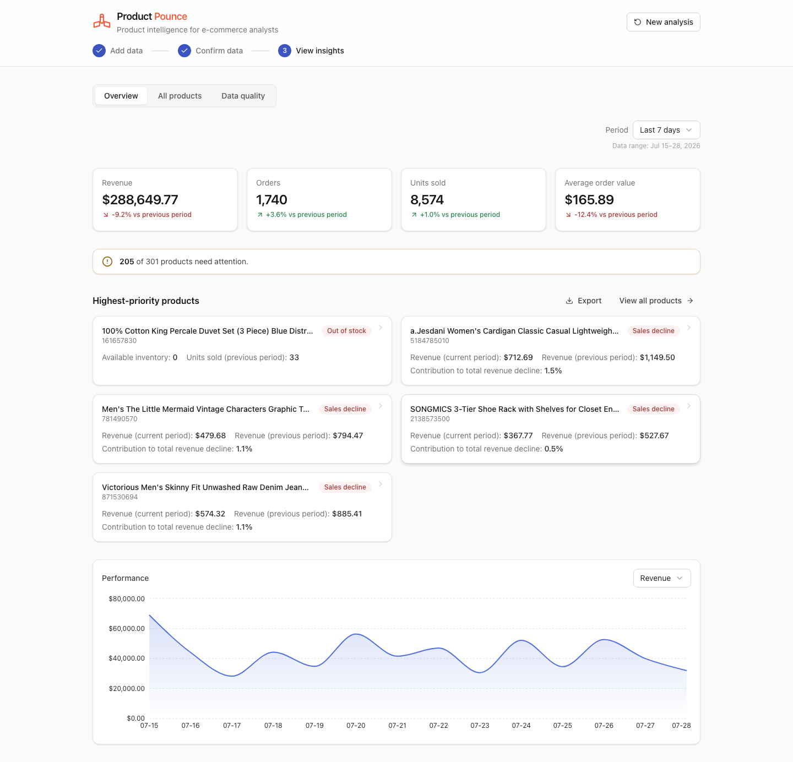
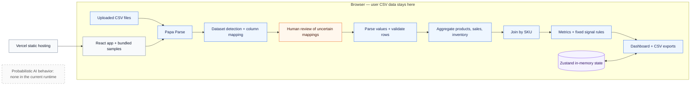

# Product Pounce

Product Pounce turns fragmented e-commerce CSV exports into a prioritized, explainable list of products that need attention—all locally in the browser.

**Live demo:** [product-pounce.vercel.app](https://product-pounce.vercel.app/)



## Overview

Product Pounce is for e-commerce analysts and store operators who receive product, sales, and inventory exports with inconsistent schemas. Finding a stockout, revenue decline, margin concern, or data-quality problem otherwise requires cleaning and cross-referencing spreadsheets before analysis can begin.

The application detects each dataset, proposes column mappings, validates and joins the records, and converts the result into a reviewable attention queue. Users get the underlying evidence, calculations, source rows, and exports—not only a dashboard score.

## Key Features

- **Reconcile inconsistent exports faster.** Product Pounce recognizes common header aliases, partial matches, and small spelling differences, then asks the user to review uncertain required fields.
- **Prioritize the products worth investigating.** Fixed, inspectable rules surface stockouts, sales declines, low inventory, slow-moving stock, margin concerns, reputation signals, price inconsistencies, and structural data issues.
- **Understand every flag.** Each signal includes the detected condition, supporting values, why it matters, a suggested investigation, and the limitation of the rule.
- **Compare like-for-like periods.** Revenue, orders, units, average order value, and daily trends use equal current and previous windows anchored to the data—not the current calendar date.
- **Keep questionable data visible.** Rejected rows, invalid values, duplicates, conflicting records, missing inventory, and unmatched product IDs are summarized, previewable, and exportable.
- **Trace results back to evidence.** Product details expose calculations and the original source rows used for that SKU.
- **Continue working outside the app.** Users can export the prioritized queue, filtered product performance, data-quality summaries, and issue-level CSVs.
- **Explore without preparing files.** Bundled Walmart, Shopee, and Shein examples exercise the full workflow; Amazon and Lazada examples demonstrate catalog-only analysis.

## How It Works

1. Add one or more product, sales, or inventory CSVs—or choose a bundled sample dataset.
2. Review the detected dataset type and proposed column mappings. Low-confidence required mappings are called out for confirmation.
3. Run the analysis. The browser validates rows, aggregates each source independently, joins records by SKU, calculates metrics, and applies fixed signal rules.
4. Inspect the overview, filter the full product table, open a product to trace its evidence, and review data-quality issues.
5. Export the attention list, product metrics, or diagnostics as CSV files.

## Architecture



Every active analysis path above is deterministic: the same files, mappings, and period selection produce the same result. Dataset “confidence” is calculated from required-field coverage and rule-based header matches; it is not a model probability.

There are no model calls, prompts, embeddings, AI-generated structured outputs, backend APIs, or databases. The pipeline returns a typed `AnalysisResult` object held in Zustand for the current browser session. The only network requests made by the application are for the static app and bundled sample CSVs; uploaded files are read with the browser `File` API.

Validation happens before aggregation. Required-field failures are excluded from metrics but retained in the data-quality report. When context is incomplete, the application degrades explicitly: product-only files use catalog-only mode, incomplete history suppresses period comparisons, uncertain mappings require review, and missing or conflicting records are surfaced instead of silently guessed.

## Technical Decisions and Tradeoffs

### Client-side processing for privacy and simplicity

Uploaded files remain in the browser, eliminating a data-upload backend and server-side storage. This reduces operational complexity and limits data exposure, but it also means analysis is constrained by the user's device and is not persisted across refreshes.

### Deterministic rules instead of a language model

Schema matching and product signals use aliases, edit distance, typed parsing, and explicit thresholds. The result is reproducible, inexpensive to run, and easy to inspect. The tradeoff is less flexibility with unfamiliar schemas and no semantic interpretation of free-form product or review text.

### Aggregate before joining

Sales are aggregated by SKU and period, inventory across warehouses, and catalog records by SKU before the datasets are joined. This prevents one-to-many joins from multiplying revenue or inventory. It requires more pipeline stages, but each stage remains pure and independently testable.

### Surface uncertainty instead of hiding it

Low-confidence mappings, rejected rows, duplicate sales, conflicting catalog records, and unmatched SKUs remain visible. This adds review work, but avoids presenting incomplete inputs as trustworthy metrics.

## AI Reliability and Evaluation

Product Pounce currently uses no generative or probabilistic AI, so model hallucination and malformed model responses are not runtime failure modes. Reliability is handled at the data boundary instead:

- Exact, partial, and edit-distance header matches receive explicit confidence levels; uncertain required mappings are presented for human confirmation.
- Values are parsed and validated by type. Rows missing required IDs, dates, quantities, or prices are rejected from calculations with a recorded reason.
- Invalid dates are rejected, insufficient history withholds comparisons, and missing sales data switches the UI to a narrower catalog-only result.
- Signal thresholds and priority are centralized in [`signalsConfig.ts`](src/lib/processing/signalsConfig.ts), making behavior reviewable and changeable without prompt tuning.

The repository has broad automated regression coverage for parsing, mapping, date and currency handling, validation, aggregation, joins, metrics, signals, exports, accessibility, invalid-file recovery, and the full browser workflow. It does **not** yet include a labeled evaluation corpus, measured mapping accuracy, signal precision/recall, adversarial CSV suite, or production monitoring.

Future evaluation work should create versioned, labeled fixtures from varied marketplace schemas; measure field-mapping precision and required-field coverage; test signal behavior at threshold boundaries; and track failure categories separately from product outcomes.

## Technology Stack

| Responsibility | Technology |
| --- | --- |
| Application and UI | React 19, TypeScript, Radix UI primitives, Tailwind CSS, Motion, Lucide icons |
| Client state | Zustand |
| CSV ingestion and export | Papa Parse, browser File and Blob APIs |
| Data pipeline | Pure TypeScript modules for normalization, validation, aggregation, joins, metrics, and signals |
| Visualization | Recharts |
| Build and local development | Vite 8 |
| Quality | Vitest, Testing Library, Playwright, oxlint, TypeScript compiler |
| Hosting | Static deployment on Vercel (live demo) |

## Local Setup

The commands below were verified with Node.js `24.18.0` and npm `11.16.0`.

```bash
git clone https://github.com/JianTing-Li/product-data-insights.git
cd product-data-insights
npm ci
npm run dev
```

Open the URL printed by Vite, normally [http://localhost:5173](http://localhost:5173).

To verify the production build locally:

```bash
npm run build
npm run preview
```

## Environment Variables

No environment variables are required. The current application has no API keys, model credentials, database connection, or server-side configuration. Do not add secrets to `.env` files or client-side `VITE_*` variables; values bundled into a Vite client build are visible to users.

## Testing

```bash
# Unit and pipeline tests
npm test

# Static analysis
npm run lint

# Type-check and production build
npm run build

# Install the browser once on a new machine, then run end-to-end tests
npx playwright install chromium
npm run e2e
```

At the time of this README update, the suite contains 261 passing Vitest tests across 22 files and 8 passing Chromium end-to-end tests.

## Current Limitations and Planned Improvements

- **No probabilistic AI is implemented.** A future model-assisted mapper could propose mappings for truly unfamiliar schemas, but it should remain behind schema validation, confidence thresholds, and human confirmation.
- **No formal evaluation benchmark exists.** Build a labeled multi-marketplace fixture set before making accuracy claims or introducing model-assisted behavior.
- **Analysis is session-only and synchronous.** Zustand state is not persisted, and large CSVs can block the main browser thread. Web Workers, file-size guidance, and performance benchmarks are sensible next steps.
- **Rules are global and fixed.** Signal thresholds are centralized but not configurable per business, category, season, or risk tolerance.
- **Ambiguous numeric dates default to month/day/year.** Validation records the ambiguity internally, but the current UI does not surface that warning for confirmation.
- **Inputs are CSV-only.** There are no direct marketplace, warehouse, or analytics connectors, scheduled refreshes, authentication, or collaboration features.
- **Browser coverage is narrow.** End-to-end tests currently target desktop Chromium; cross-browser, mobile, and larger-data coverage remain future work.
- **The initial bundle is large.** The verified build emits an approximately 890 KB minified JavaScript chunk (about 272 KB gzip); route or component-level code splitting would improve initial delivery.
- **Development dependency advisory.** `npm audit` currently reports one high-severity advisory in the transitive development dependency `nanoid`; `npm audit --omit=dev` reports no production dependency vulnerabilities. The lockfile should be updated and the full suite rerun.

## What This Project Demonstrates

- **Product thinking:** converts a broad analytics problem into a short, evidence-first decision workflow with progressive disclosure.
- **End-to-end ownership:** covers ingestion, interaction design, pipeline logic, visualization, export, accessibility, testing, and deployment-facing documentation.
- **AI system design:** draws a deliberate boundary between tasks that benefit from probabilistic inference and tasks where deterministic, inspectable logic is safer today.
- **Reliability and failure handling:** represents uncertainty explicitly, validates inputs, withholds unsupported comparisons, and preserves rejected data for review.
- **Production-minded engineering:** uses typed domain boundaries, pure testable stages, privacy-conscious architecture, browser-level regression tests, and honest operational constraints.

## Author

**Jian Ting Li**<br>
[GitHub](https://github.com/JianTing-Li) · [jiantingli@pursuit.org](mailto:jiantingli@pursuit.org)
